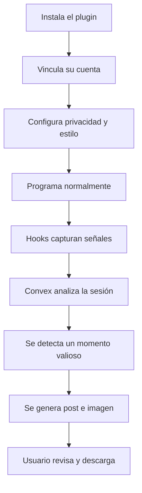
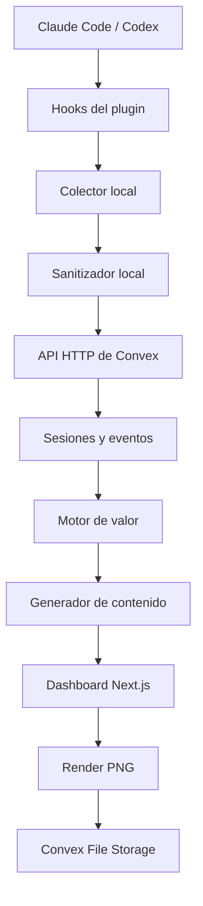

# BuildSignal — Plan definitivo del MVP

> **Nombre provisional:** BuildSignal  
> **Tipo de producto:** plugin para agentes de programación  
> **Integraciones iniciales:** Claude Code y Codex  
> **Backend obligatorio:** Convex  
> **Salida principal del MVP:** publicación escrita + imagen PNG lista para descargar  
> **Salida futura:** video con voz en off, animaciones programáticas y presets para redes sociales

---

## 1. Resumen ejecutivo

BuildSignal es un plugin que observa de forma segura una sesión de programación, identifica cuándo el desarrollador resolvió algo con valor educativo y transforma ese aprendizaje en contenido listo para publicar.

El producto parte de un problema humano concreto: muchos desarrolladores, especialmente principiantes, creen que no tienen nada interesante que compartir. Durante el día resuelven errores, descubren comportamientos inesperados, descartan enfoques, mejoran procesos o encuentran causas raíz; sin embargo, perciben ese trabajo como rutinario y pierden el contexto necesario para convertirlo en contenido.

BuildSignal funciona como una capa de observabilidad creativa. No mide productividad ni juzga al desarrollador. Reconoce momentos con potencial narrativo, reúne evidencia del problema y la solución, explica por qué pueden ayudar a otras personas y produce un contenido que el usuario puede revisar y publicar.

### Promesa principal

> **Termina de programar y recibe una historia publicable sobre lo que acabas de aprender.**

### Mensaje emocional

> **No necesitas crear algo revolucionario para tener algo valioso que enseñar.**

### Transformación central

```text
Trabajo invisible
      ↓
Aprendizaje detectado
      ↓
Historia con evidencia
      ↓
Post e imagen listos
```

---

## 2. Problema que resuelve

Los desarrolladores suelen enfrentar cuatro barreras para crear contenido:

1. **No reconocen el valor de su trabajo cotidiano.** Consideran que solucionar un bug o entender una configuración no es suficientemente novedoso.
2. **Pierden el contexto.** Al finalizar el día recuerdan la solución, pero olvidan los intentos, el error inicial y el descubrimiento que hacían interesante la historia.
3. **La producción demanda tiempo adicional.** Redactar, estructurar, diseñar una imagen y adaptar el contenido compite con el tiempo de desarrollo.
4. **Temen comunicar algo incorrecto o poco relevante.** Esto afecta especialmente a principiantes y personas que quieren construir una marca personal, pero todavía no publican.

BuildSignal reduce esas barreras al capturar señales verificables mientras ocurre el trabajo y convertirlas posteriormente en una publicación fundamentada.

---

## 3. Posicionamiento

BuildSignal no debe presentarse como:

- un generador genérico de posts;
- una herramienta que convierte commits en frases motivacionales;
- un grabador permanente de pantalla;
- un sistema de vigilancia o evaluación laboral;
- un publicador automático sin control humano.

Debe presentarse como:

> **Un copiloto de contenido para desarrolladores que encuentra aprendizajes dentro de su trabajo real y los convierte en historias demostrables.**

### Diferenciación

El valor diferencial no es solamente generar texto. El sistema combina:

- contexto de la sesión;
- evidencia técnica;
- detección automática de valor;
- criterio narrativo;
- privacidad local;
- contenido visual generado mediante código;
- revisión humana antes de publicar.

---

## 4. Alcance cerrado del MVP

### 4.1 Funcionalidades obligatorias

El MVP debe permitir:

1. Instalar el plugin en Claude Code.
2. Reutilizar el mismo colector en Codex.
3. Vincular una instalación con una cuenta.
4. Capturar eventos mediante hooks.
5. Sanitizar datos antes de enviarlos.
6. Registrar sesiones y eventos en Convex.
7. Detectar un momento con valor educativo.
8. Explicar por qué ese momento tiene valor.
9. Generar un post para LinkedIn.
10. Generar una imagen profesional de 1080 × 1350 px.
11. Permitir revisar y editar el contenido.
12. Descargar la imagen como PNG.
13. Copiar el texto de la publicación.
14. Registrar si el usuario acepta, edita o descarta el resultado.

### 4.2 Salida exacta del MVP

Cada momento aprobado produce:

```text
titulo-o-hook.txt
publicacion-linkedin.txt
imagen-linkedin-1080x1350.png
```

El dashboard mostrará además:

- puntuación de valor;
- explicación de la puntuación;
- problema detectado;
- descubrimiento;
- solución;
- aprendizaje;
- evidencia utilizada;
- advertencias de privacidad.

### 4.3 Fuera del alcance principal

No entra al camino crítico:

- grabación de pantalla;
- voz en off;
- video;
- publicación directa en redes;
- clonación de voz;
- editor visual avanzado;
- aplicación móvil;
- múltiples idiomas;
- análisis de meses de historial;
- métricas de engagement;
- integración con todas las redes;
- entrenamiento o fine-tuning de modelos.

El video solo se inicia si todo el MVP funciona de extremo a extremo y queda tiempo disponible.

---

## 5. Usuario objetivo

### Segmento primario

Desarrolladores principiantes e intermedios que:

- usan Claude Code, Codex u otros agentes;
- quieren comenzar a publicar;
- sienten que su trabajo no es suficientemente interesante;
- desean construir marca personal;
- no tienen tiempo para escribir y diseñar contenido;
- valoran mantener el control sobre su código.

### Segmento secundario

- estudiantes de software;
- desarrolladores que construyen en público;
- freelancers;
- fundadores técnicos;
- DevRel y equipos de ingeniería;
- creadores técnicos que quieren aumentar su frecuencia de publicación.

---

## 6. Flujo definitivo del usuario



### 6.1 Instalación

El usuario instala el plugin desde el marketplace correspondiente o mediante un comando. El paquete contiene:

- configuraciones de hooks;
- colector local en Node.js;
- sanitizador;
- comandos MCP opcionales;
- conexión con Convex;
- instrucciones del producto.

Mensaje inicial:

> BuildSignal está listo. Mientras programas, detectará problemas, decisiones y aprendizajes que podrían convertirse en contenido. Nada será publicado sin tu autorización.

### 6.2 Vinculación

El plugin abre una URL de conexión. El usuario inicia sesión mediante Clerk y vincula el dispositivo con un código de un solo uso.

Para el MVP puede simplificarse a:

```text
npx buildsignal login
```

El navegador autentica al usuario y entrega un token de instalación. El plugin lo conserva fuera del repositorio.

### 6.3 Onboarding

El usuario selecciona:

- objetivo: aprender en público, marca personal, mostrar avances o contenido educativo;
- tono: cercano, técnico, profesional o directo;
- audiencia: principiantes, intermedios o avanzados;
- red principal: LinkedIn;
- color de marca;
- nivel de privacidad.

La configuración recomendada debe venir preseleccionada para completar el onboarding en menos de dos minutos.

### 6.4 Autorización por proyecto

Al entrar en un repositorio nuevo:

> ¿Quieres activar BuildSignal en este proyecto?

El usuario puede decidir:

- activar;
- mantener todo local;
- permitir fragmentos relevantes;
- excluir el proyecto.

La autorización es por proyecto y puede revocarse.

### 6.5 Trabajo normal

El usuario no debe iniciar una grabación. Continúa conversando con Claude Code o Codex y ejecutando herramientas normalmente.

El plugin recopila señales como:

- objetivo inicial;
- errores relevantes;
- comandos y códigos de salida;
- archivos modificados;
- tests fallidos y exitosos;
- resumen de diff;
- explicación final.

### 6.6 Detección

Al terminar un turno o sesión, BuildSignal analiza si existe una historia con problema, descubrimiento, solución y evidencia.

Ejemplo de notificación:

> Encontré algo que vale la pena contar: descubriste que el suavizado de Web Audio estaba invalidando tu detector. Hay una historia clara con problema, causa y solución.

Acciones:

- Ver historia.
- Guardar para después.
- No es relevante.

### 6.7 Generación

Cuando el momento supera el umbral, se produce:

- hook;
- cuerpo del post;
- conclusión;
- CTA opcional;
- hashtags;
- manifiesto de imagen;
- imagen PNG.

### 6.8 Revisión y descarga

El usuario puede:

- editar el título;
- corregir el texto;
- eliminar evidencia;
- cambiar el color;
- regenerar;
- copiar la publicación;
- descargar el PNG;
- descartar el contenido.

Nada se publica automáticamente.

---

## 7. Arquitectura lógica



### Principio técnico

La captura y la lógica de privacidad viven localmente. Convex coordina el estado, persiste datos compactos, ejecuta el análisis y sincroniza el dashboard. El render de imagen del MVP ocurre en el navegador para evitar infraestructura adicional.

---

## 8. Stack tecnológico

| Área             | Tecnología                   |
| ---------------- | ---------------------------- |
| Lenguaje         | TypeScript                   |
| Monorepo         | pnpm workspaces o Turborepo  |
| Plugin           | Node.js                      |
| Integración      | Hooks de Claude Code y Codex |
| Contratos        | Zod                          |
| Backend          | Convex                       |
| Autenticación    | Clerk                        |
| Frontend         | Next.js + React              |
| UI               | Tailwind CSS + shadcn/ui     |
| IA               | Proveedor intercambiable     |
| Código resaltado | Shiki                        |
| Render de imagen | React + html-to-image        |
| Archivos         | Convex File Storage          |
| Hosting          | Vercel                       |

### Decisiones de bajo costo

- No mantener un servidor tradicional.
- Renderizar PNG en el navegador.
- Enviar solo resúmenes sanitizados al modelo.
- Aplicar reglas antes de invocar IA.
- Generar contenido solo para momentos sobre el umbral.
- Crear inicialmente un único formato visual.
- Mantener una interfaz de proveedor para aprovechar créditos disponibles.

---

## 9. Estructura del repositorio

```text
buildsignal/
├── apps/
│   └── web/
│       ├── app/
│       ├── components/
│       └── features/
├── packages/
│   ├── core/
│   ├── collector/
│   ├── sanitizer/
│   ├── value-engine/
│   ├── image-renderer/
│   └── shared-types/
├── plugins/
│   ├── claude-code/
│   └── codex/
├── convex/
│   ├── schema.ts
│   ├── http.ts
│   ├── installations.ts
│   ├── sessions.ts
│   ├── events.ts
│   ├── moments.ts
│   ├── generation.ts
│   └── assets.ts
└── package.json
```

---

## 10. Contrato de eventos

```ts
type SessionEvent = {
  eventId: string;
  sessionId: string;
  installationId: string;
  source: "claude-code" | "codex";
  type:
    | "session_started"
    | "user_prompt"
    | "tool_result"
    | "file_changed"
    | "test_failed"
    | "test_passed"
    | "turn_stopped"
    | "session_ended";
  timestamp: number;
  payload: Record<string, unknown>;
  sanitized: boolean;
};
```

### Reglas del colector

- Generar `eventId` idempotente.
- Normalizar eventos de ambos agentes.
- Escribir en una cola local si no existe conexión.
- Enviar lotes pequeños.
- Reintentar con backoff.
- No bloquear la sesión del agente.
- Truncar resultados extensos.
- Evitar almacenar la conversación completa.

### Archivos locales

```text
~/.buildsignal/
├── config.json
└── queue.jsonl
```

---

## 11. Modelo de datos de Convex

### `users`

- `clerkUserId`
- `name`
- `contentStyle`
- `audienceLevel`
- `preferredPlatform`
- `accentColor`
- `createdAt`

### `installations`

- `userId`
- `source`
- `tokenHash`
- `deviceName`
- `lastSeenAt`
- `enabled`

### `projects`

- `userId`
- `repositoryHash`
- `displayName`
- `privacyMode`
- `createdAt`

### `sessions`

- `projectId`
- `installationId`
- `source`
- `status`
- `startedAt`
- `endedAt`
- `analysisStatus`

### `events`

- `sessionId`
- `eventId`
- `type`
- `summary`
- `payload`
- `timestamp`
- `riskFlags`

### `moments`

- `sessionId`
- `category`
- `title`
- `problem`
- `discovery`
- `solution`
- `lesson`
- `score`
- `scoreBreakdown`
- `evidenceEventIds`
- `sensitivityFlags`
- `status`

### `postDrafts`

- `momentId`
- `platform`
- `hook`
- `body`
- `takeaway`
- `cta`
- `hashtags`
- `imageManifest`
- `status`

### `assets`

- `postDraftId`
- `storageId`
- `width`
- `height`
- `format`
- `createdAt`

### `feedback`

- `momentId`
- `action`
- `editedFields`
- `createdAt`

### Funciones mínimas

```text
installations.create
sessions.start
sessions.finish
events.ingestBatch
moments.getBySession
generation.analyzeSession
generation.createPost
assets.generateUploadUrl
feedback.register
```

---

## 12. Motor de detección de valor

La complejidad del código no debe ser el criterio central. Una corrección de dos líneas puede contener una enseñanza muy reutilizable.

### Prefiltro determinista

No invocar el modelo si no existe al menos una señal:

- error seguido de éxito;
- test fallido seguido de test aprobado;
- varios intentos;
- descubrimiento de causa raíz;
- métrica antes y después;
- nuevo caso de prueba;
- cambio de arquitectura con trade-off;
- automatización de una tarea repetitiva;
- simplificación verificable.

### Fórmula

```text
Valor =
25% problema
+ 25% aprendizaje
+ 20% reutilización
+ 15% evidencia
+ 15% claridad narrativa
- penalización por riesgo
```

### Umbrales

| Puntaje | Acción                  |
| ------: | ----------------------- |
|  70–100 | Generar post e imagen   |
|   45–69 | Guardar como sugerencia |
|    0–44 | No notificar            |

### Resultado estructurado

```ts
type MomentAnalysis = {
  shouldCreate: boolean;
  score: number;
  reason: string;
  category:
    | "bug_fix"
    | "lesson"
    | "performance"
    | "architecture"
    | "automation";
  problem: string;
  discovery: string;
  solution: string;
  lesson: string;
  evidenceEventIds: string[];
  sensitivityFlags: string[];
};
```

---

## 13. Generación del post

### Contrato

```ts
type PostDraft = {
  hook: string;
  body: string;
  takeaway: string;
  cta?: string;
  hashtags: string[];
  imageManifest: ImageManifest;
};
```

### Estructura narrativa

1. Hook.
2. Contexto.
3. Problema.
4. Suposición inicial.
5. Descubrimiento.
6. Solución.
7. Resultado verificable.
8. Aprendizaje.
9. Cierre o CTA.

### Restricciones

- No inventar métricas.
- No afirmar éxito sin evidencia.
- No revelar datos sensibles.
- Evitar exageraciones.
- Mantener el estilo del usuario.
- Explicar términos técnicos cuando sea necesario.
- Mantener una extensión aproximada máxima de 1,300 caracteres para el MVP.

---

## 14. Generación de imágenes

### Formato inicial

```text
Resolución: 1080 × 1350 px
Relación: 4:5
Formato: PNG
Objetivo principal: LinkedIn
```

### Por qué se genera mediante código

El contenido técnico debe ser exacto. Un modelo de imagen puede deformar texto, inventar símbolos o volver ilegible el código. Por ello se genera un manifiesto estructurado y se renderiza con React, HTML y CSS.

### Manifiesto

```ts
type ImageManifest = {
  template: "bug-fix" | "before-after" | "lesson";
  headline: string;
  eyebrow: string;
  problem: string;
  codeBefore?: string;
  codeAfter?: string;
  result: string;
  takeaway: string;
  accentColor: string;
  authorName?: string;
};
```

### Plantilla prioritaria: Bug → causa → solución

- etiqueta superior;
- titular fuerte;
- error o problema;
- causa descubierta;
- fragmento breve de código;
- resultado;
- aprendizaje;
- footer discreto.

### Reglas visuales

- Una idea central.
- Máximo ocho líneas de código.
- Alto contraste.
- Texto legible en móvil.
- No usar párrafos largos.
- Espaciado consistente.
- Código con Shiki.
- Sin texto cortado.
- Footer pequeño.
- Menos de 2 MB.

### Flujo de render

1. Crear `SocialPostCard` en React.
2. Aplicar el manifiesto.
3. Resaltar código con Shiki.
4. Esperar fuentes.
5. Exportar con `html-to-image`.
6. Obtener `Blob` PNG.
7. Solicitar upload URL a Convex.
8. Subir a File Storage.
9. Registrar el asset.
10. Habilitar descarga.

---

## 15. Privacidad y seguridad

La confianza es parte del producto, no un aviso secundario.

### Reglas obligatorias

- Sanitizar antes de enviar.
- No enviar transcripciones completas.
- No almacenar razonamiento interno.
- No capturar pantalla.
- No publicar automáticamente.
- Excluir secretos y credenciales.
- Autorizar por proyecto.
- Mostrar la evidencia utilizada.
- Permitir eliminar sesiones y momentos.

### Archivo `.contentignore`

```text
.env*
credentials/**
private/**
client-data/**
*.key
*.pem
```

### Límites

- Máximo 20 líneas por fragmento.
- Máximo 200 caracteres por salida de terminal relevante.
- Reemplazar rutas personales.
- Ocultar correos.
- Detectar tokens Bearer.
- Detectar patrones de API keys.
- No procesar archivos ignorados.

### Pruebas de privacidad

Sembrar entradas con:

- API key falsa;
- token Bearer;
- correo;
- ruta personal;
- archivo `.env`;
- nombre de cliente;
- clave privada ficticia.

El criterio de aceptación es cero filtraciones hacia Convex.

---

## 16. Plan de ejecución por fases

## Fase 0 — Cierre de alcance

**Duración:** 30 minutos.

### Tareas

- Confirmar funcionalidades Must.
- Confirmar exclusiones.
- Asignar responsables.
- Seleccionar caso de demo.
- Definir contrato de eventos.

### Terminado cuando

Todo el equipo acepta esta historia:

> Cuando un desarrollador resuelve un problema verificable, BuildSignal detecta el aprendizaje, genera una publicación y entrega una imagen descargable.

## Fase 1 — Base y vertical slice

**Duración:** 1 hora.

### Tareas

- Crear monorepo.
- Inicializar Next.js.
- Inicializar Convex.
- Configurar Clerk.
- Crear `shared-types`.
- Crear un evento manual.
- Mostrarlo en el dashboard.

### Terminado cuando

Un script puede enviar un evento y la web puede mostrarlo.

## Fase 2 — Modelo de Convex

**Duración:** 1 hora.

### Tareas

- Definir esquema.
- Crear índices.
- Crear HTTP Action de ingestión.
- Implementar idempotencia.
- Crear queries del dashboard.
- Implementar upload URL.

### Terminado cuando

Una sesión, sus eventos y su estado aparecen en tiempo real.

## Fase 3 — Plugin y hooks

**Duración:** 2 horas.

### Tareas

- Crear `buildsignal-hook`.
- Leer JSON desde stdin.
- Normalizar eventos.
- Crear cola local.
- Configurar Claude Code.
- Configurar Codex con el mismo ejecutable.
- Enviar lotes a Convex.

### Terminado cuando

Una sesión real de Claude Code produce eventos en Convex y el adaptador de Codex puede reutilizar el colector.

## Fase 4 — Sanitización

**Duración:** 1 hora.

### Tareas

- Implementar `.contentignore`.
- Crear reglas de secretos.
- Truncar outputs.
- Eliminar rutas y correos.
- Crear pruebas sembradas.

### Terminado cuando

Ningún secreto de prueba llega a Convex.

## Fase 5 — Detección de valor

**Duración:** 1 hora y 30 minutos.

### Tareas

- Crear prefiltro.
- Construir resumen de sesión.
- Invocar modelo con salida estructurada.
- Calcular score.
- Guardar explicación y evidencia.
- Evitar duplicados.

### Terminado cuando

El caso real de demo supera el umbral y un cambio trivial no genera contenido.

## Fase 6 — Generación del post

**Duración:** 1 hora.

### Tareas

- Crear prompt estructurado.
- Validar respuesta con Zod.
- Guardar borrador.
- Crear editor.
- Implementar copiar y regenerar.

### Terminado cuando

El usuario puede leer, editar y copiar una publicación fundamentada.

## Fase 7 — Imagen PNG

**Duración:** 2 horas.

### Tareas

- Implementar `SocialPostCard`.
- Crear plantilla Bug → causa → solución.
- Integrar Shiki.
- Exportar 1080 × 1350.
- Subir a Convex.
- Descargar PNG.

### Terminado cuando

La imagen es legible en móvil, pesa menos de 2 MB y no tiene contenido cortado.

## Fase 8 — Integración completa

**Duración:** 1 hora.

### Recorrido

```text
Hook real
   ↓
Evento en Convex
   ↓
Momento detectado
   ↓
Post generado
   ↓
Imagen descargable
```

### Terminado cuando

El recorrido funciona sin editar manualmente la base de datos.

## Fase 9 — QA y demo

**Duración:** 1 hora.

### Casos

- Bug resuelto.
- Cambio trivial.
- Secreto presente.
- Sesión interrumpida.
- Evento duplicado.
- Pérdida de conexión.
- Edición de post.
- Regeneración.
- Descarga de PNG.
- Ejecución en Codex.

### Terminado cuando

Existe una demo reproducible y un respaldo sanitizado.

---

## 17. Cronograma de 12 horas

|       Horas | Trabajo                           |
| ----------: | --------------------------------- |
|   0:00–0:30 | Alcance, roles y contratos        |
|   0:30–2:00 | Monorepo, Next.js, Convex y Clerk |
|   2:00–4:00 | Hooks, colector e ingestión       |
|   4:00–5:00 | Sanitización                      |
|   5:00–6:30 | Detector de momentos              |
|   6:30–7:30 | Generación del post               |
|   7:30–9:30 | Generador de imagen               |
|  9:30–10:30 | Integración completa              |
| 10:30–11:30 | QA y correcciones                 |
| 11:30–12:00 | Ensayo de demo                    |

### Regla de integración

A más tardar en la hora 8, todos deben detener el trabajo aislado y concentrarse en integrar. Una funcionalidad incompleta pero conectada tiene más valor para la demo que cuatro componentes excelentes que no trabajan juntos.

---

## 18. Distribución del equipo

### Equipo de cuatro

| Persona | Responsabilidad                          |
| ------- | ---------------------------------------- |
| A       | Plugin, hooks, colector y cola local     |
| B       | Convex, autenticación y almacenamiento   |
| C       | Motor de valor y generación de contenido |
| D       | Dashboard, diseño y render de imagen     |

### Equipo de tres

| Persona | Responsabilidad         |
| ------- | ----------------------- |
| A       | Plugin y sanitización   |
| B       | Convex y motor de valor |
| C       | Dashboard e imagen      |

### Responsabilidad compartida

- Revisar contratos.
- Probar integración.
- Mantener demo.
- No ampliar alcance sin acuerdo.

---

## 19. Backlog MoSCoW

### Must have

- Claude Code funcional.
- Colector compartido.
- Convex conectado.
- Eventos reales.
- Sanitización.
- Detección de valor.
- Post generado.
- Imagen 1080 × 1350.
- Dashboard.
- Copiar y descargar.

### Should have

- Adaptador Codex probado.
- Personalización de color.
- Regeneración parcial.
- Feedback de aceptación.
- Segunda plantilla visual.

### Could have

- Carrusel.
- Imagen cuadrada.
- Inglés.
- Perfil de marca.
- Historial avanzado.
- Compartir mediante enlace.

### Won't have en el MVP

- Publicación automática.
- Screen recording.
- Video completo.
- Editor de timeline.
- Clonación de voz.
- Análisis masivo de repositorios.

---

## 20. Métricas y criterios de aceptación

| Métrica                     |                            Objetivo |
| --------------------------- | ----------------------------------: |
| Instalación                 |                  Menos de 2 minutos |
| Hook síncrono               |                 Menos de 100–150 ms |
| Evento visible              |                 Menos de 5 segundos |
| Análisis                    |                Menos de 30 segundos |
| Secretos filtrados          |                                   0 |
| Casos relevantes detectados |                   4 de 5 preparados |
| Falsos positivos            |                 Máximo 1 por sesión |
| Producción completa         |    Menos de 3 minutos tras terminar |
| Imagen                      |          1080 × 1350, menos de 2 MB |
| Intervención técnica        | Ninguna durante el recorrido normal |

### Métrica de producto posterior

- Porcentaje de momentos aceptados.
- Porcentaje editado.
- Tiempo hasta descargar.
- Publicaciones por usuario por semana.
- Motivos de descarte.
- Tasa de activación tras instalar.

---

## 21. Estados de interfaz

```text
Capturando sesión
Analizando aprendizaje
Momento detectado
Generando publicación
Preparando imagen
Contenido listo
```

### Manejo de fallos

| Fallo              | Comportamiento                       |
| ------------------ | ------------------------------------ |
| Convex no responde | Guardar en cola local y reintentar   |
| Modelo falla       | Conservar sesión y mostrar reintento |
| Imagen falla       | Mantener preview y regenerar         |
| No existe valor    | No notificar                         |
| Secreto detectado  | Bloquear y solicitar revisión        |
| Evento duplicado   | Ignorar por `eventId`                |
| Sesión incompleta  | Guardar como pendiente               |

---

## 22. Caso de demostración

### OratorIA: falsos positivos en el detector

La demo puede utilizar una sesión real donde:

1. El detector de muletillas marca falsos positivos.
2. Se piensa inicialmente que los umbrales son incorrectos.
3. Se realizan varios ajustes sin resolver el problema.
4. Se descubre que `smoothingTimeConstant = 0.8` mezcla espectros.
5. Se corrige la configuración.
6. Las pruebas finales pasan.

### Historia detectada

```text
Problema:
El detector generaba falsos positivos.

Descubrimiento:
El navegador suavizaba los espectros.

Solución:
Desactivar el suavizado y ampliar la ventana de análisis.

Aprendizaje:
Antes de modificar un algoritmo, verificar cómo se transforman sus datos de entrada.
```

### Guion de presentación

1. “Muchos desarrolladores creen que no tienen nada que compartir.”
2. Mostrar una sesión real.
3. Resolver el problema.
4. Mostrar la detección automática.
5. Abrir la explicación del valor.
6. Mostrar el post.
7. Generar la imagen.
8. Descargar el PNG.
9. Cerrar con la promesa del producto.

### Demo de respaldo

Mantener una sesión real previamente sanitizada que pueda reproducirse si falla internet. No usar mockdata en el producto; el respaldo solo protege la presentación.

---

## 23. Riesgos y mitigaciones

| Riesgo                      | Impacto | Mitigación                                              |
| --------------------------- | ------- | ------------------------------------------------------- |
| Filtración de secretos      | Crítico | Sanitización local, `.contentignore`, pruebas sembradas |
| Demasiados falsos positivos | Alto    | Prefiltro, umbral alto, feedback                        |
| Contenido genérico          | Alto    | Evidencia real, estructura narrativa, estilo personal   |
| Interrupción del flujo      | Alto    | Hooks asíncronos, notificación solo al final            |
| Fragmentación entre agentes | Medio   | Contrato común y adaptadores separados                  |
| Imagen ilegible             | Medio   | Plantillas programáticas y QA móvil                     |
| Dependencia del modelo      | Medio   | Interfaz de proveedor y validación Zod                  |
| Demo dependiente de red     | Medio   | Sesión sanitizada reproducible                          |
| Expansión de alcance        | Alto    | MoSCoW cerrado y checkpoint cada 3 horas                |

---

## 24. Fase futura: generación de video

Esta fase está pendiente y no debe iniciarse hasta que el MVP esté integrado.

### Objetivo futuro

Generar automáticamente un MP4 con:

- voz en off;
- animaciones de código;
- terminal animada;
- diff antes/después;
- subtítulos;
- música opcional;
- presets por red social.

### Flujo futuro

```text
Momento detectado
      ↓
Guion audiovisual
      ↓
Voz en off
      ↓
Storyboard
      ↓
Animaciones programáticas
      ↓
Render MP4
      ↓
Descarga por red social
```

### Presets previstos

| Uso                   |  Resolución | Relación |
| --------------------- | ----------: | -------: |
| TikTok, Reels, Shorts | 1080 × 1920 |     9:16 |
| LinkedIn vertical     | 1080 × 1350 |      4:5 |
| Cuadrado              | 1080 × 1080 |      1:1 |
| YouTube tradicional   | 1920 × 1080 |     16:9 |

### Tecnologías previstas

- Remotion.
- FFmpeg.
- Shiki.
- ElevenLabs o proveedor equivalente.
- Componentes responsivos por relación de aspecto.

### Condición para iniciar

Solo iniciar video si se cumplen todos estos puntos:

- hooks estables;
- Convex estable;
- sanitización aprobada;
- detección funcional;
- post editable;
- PNG descargable;
- demo ensayada;
- existe tiempo sobrante real.

---

## 25. Checkpoints cada tres horas

Existe una revisión programada cada tres horas en la zona horaria `America/Lima`.

Cada checkpoint debe responder:

1. ¿Qué fase está completada?
2. ¿Qué funciona realmente de extremo a extremo?
3. ¿Cuál es el principal bloqueo?
4. ¿Se está ampliando el alcance?
5. ¿Cuál es el objetivo concreto de las siguientes tres horas?
6. ¿Ya funciona `hook → Convex → momento → post → imagen`?

### Reglas de decisión

- Si una integración básica no funciona, detener tareas visuales.
- Si existen bloqueos de autenticación, usar temporalmente una instalación preconfigurada para la demo y documentar la deuda.
- Si Codex retrasa el flujo principal, demostrar Claude Code y conservar el núcleo compatible.
- Si la imagen no se exporta, priorizar un template fijo antes que un editor.
- Si el video amenaza el MVP, cancelarlo inmediatamente.

---

## 26. Primeros pasos inmediatos

### Primeros 30 minutos

1. Crear repositorio y monorepo.
2. Asignar responsables.
3. Copiar el contrato `SessionEvent`.
4. Crear proyecto Convex.
5. Inicializar Next.js.
6. Elegir el caso OratorIA como demo.
7. Abrir un canal único para bloqueos.

### Primera meta técnica

Antes de diseñar pantallas completas, conseguir:

```text
Evento manual → Convex → dashboard
```

### Segunda meta

```text
Hook real → Convex → sesión visible
```

### Tercera meta

```text
Sesión → momento → post
```

### Cuarta meta

```text
Post → imagen PNG descargable
```

---

## 27. Definición final de éxito

El MVP está terminado cuando un desarrollador puede:

1. Instalar BuildSignal.
2. Activarlo en un proyecto.
3. Resolver un problema real en Claude Code o Codex.
4. Recibir un momento detectado automáticamente.
5. Comprender por qué ese momento tiene valor.
6. Revisar un post fundamentado.
7. Descargar una imagen profesional.
8. Copiar el texto.
9. Publicarlo manualmente sin diseñar ni redactar desde cero.

La demostración debe probar una sola transformación con claridad:

> **Una sesión de programación cotidiana puede convertirse en contenido valioso sin interrumpir al desarrollador.**

---

## 28. Referencias técnicas oficiales

- [Hooks de Codex](https://learn.chatgpt.com/docs/hooks)
- [Plugins de OpenAI](https://developers.openai.com/plugins/build/plugins)
- [Hooks de Claude Code](https://code.claude.com/docs/en/hooks)
- [Convex HTTP Actions](https://docs.convex.dev/functions/http-actions)
- [Convex File Storage](https://docs.convex.dev/file-storage/overview)
- [Convex y Clerk](https://docs.convex.dev/auth/clerk)
- [Límites de Convex](https://docs.convex.dev/production/state/limits)
- [Tareas programadas de ChatGPT](https://learn.chatgpt.com/docs/automations)
